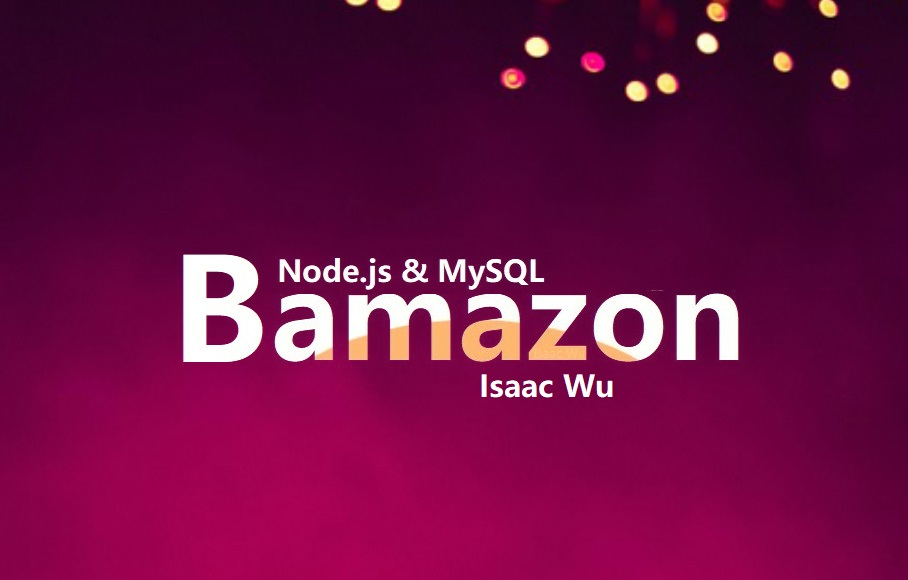

# 📦 Bamazon

## Overview
Bamazon is an Amazon-like storefront with the MySQL database. The app will take in orders from customers and deplete stock from the store's inventory. You can program your app to track product sales across your store's departments and then provide a summary of the highest-grossing departments in the store. It is a **command line app** that takes in parameters and gives you back data. The app receive user input using the `maysql`, `inquirer`, `chalk`, `figlet` and `boxen` npm packages.
####   :point_right: Click  **[>>>Here<<<](https://youtu.be/ZH--1385PGc)**  Check my :tv: video to see how it works.



## 📓 Instruction
```
Bamazon is composed with three apps.
* Bamazon customer app
* Bamazon manager app
* Bamazon supervisor app
```

##  ✒️ 1. **Customer App**: 

1. A MySQL Database called `bamazon`.
2. A Table inside of that database called `products`.
3. The products table have each of the following columns:
   * item_id (unique id for each product)
   * product_name (Name of product)
   * department_name
   * price (cost to customer)
   * stock_quantity (how much of the product is available in stores)

4. A Node application called `bamazonCustomer.js`. Running this application will first display all of the items available for sale. Include the ids, names, and prices of products for sale.

5. The app will then prompt users with two messages.
   * The first message ask customers the ID of the product they would like to buy.
   * The second message ask how many units of the product they would like to buy.

6. Once the customer has placed the order, Bamazon will check if the store has enough of the product to meet the customer's request.
   * If not, the app will log a phrase like `Insufficient quantity!`, and then prevent the order from going through.

7. If the store _does_ have enough of the product, Bamazon will fulfill the customer's order.
   * This means updating the SQL database to reflect the remaining quantity.
   * Once the update goes through, show the customer the total cost of their purchase.

 
## ✒️ 2. **Manager App**: 

* A Node application called `bamazonManager.js`. Running this application will:

  * List a set of menu options:
    * View Products for Sale
    * View Low Inventory
    * Add to Inventory
    * Add New Product

  * If a manager selects `View Products for Sale`, the app will list every available item: the item IDs, names, prices, and quantities.
  * If a manager selects `View Low Inventory`, then it will list all items with an inventory count lower than five.
  * If a manager selects `Add to Inventory`, it will display a prompt that will let the manager "add more" of any item in the store.
  * If a manager selects `Add New Product`, it will allow the manager to add a completely new product to the store.


## ✒️ 3.  **Supervisor App**: 

1. A MySQL table called `departments` includes the following columns:
   * department_id
   * department_name
   * over_head_costs (A dummy number you set for each department)

2. When a customer purchases anything from the store, the price of the product multiplied by the quantity purchased is added to the product's product_sales column.

3. Another Node app called `bamazonSupervisor.js`. Running this application will list a set of menu options:
   * View Product Sales by Department
   * Create New Department

4. When a supervisor selects `View Product Sales by Department`, the app will display a summarized table in their terminal/bash window. 

| department_id | department_name | over_head_costs | product_sales | total_profit |
| ------------- | --------------- | --------------- | ------------- | ------------ |
| 01            | Electronics     | 10000           | 20000         | 10000        |
| 02            | Clothing        | 60000           | 100000        | 40000        |

5. The `total_profit` column is calculated on the fly using the difference between `over_head_costs` and `product_sales`. `total_profit` won't be stored in any database.


## Author
* [Isaac Wu](https://github.com/squall2046)
* [Game Repo](https://github.com/squall2046/Bamazon)

## Copyright
Isaac Wu © 2019 All Rights Reserved

